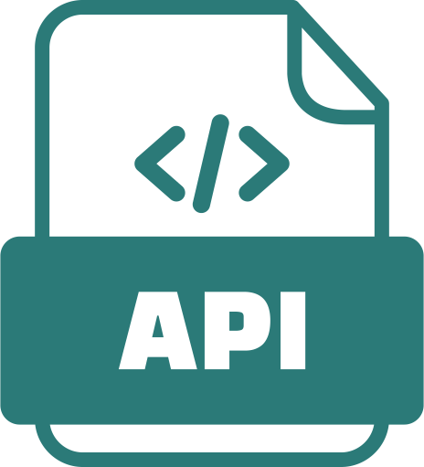

<h1 align="center">Olá :wave:, meu nome é Thales || </h1>
<h3 align="center"> :computer: Atualmente, estou trabalhando como freelancer em Desenvolvimento Web FullStack, criando sites modernos e responsivos focados em performance, SEO e experiência do usuário</h3>
&nbsp;

## &nbsp;&nbsp;&nbsp;Usando tecnologias como:

  
  
  
  
  
  
  
  
  
  
  
  

&nbsp;
&nbsp;

<h4>Sobre mim:</h4>
<h5> :seedling: No momento, estou me aprofundando em back-end com PHP e MySQL, além de melhorar minhas habilidades com Cybersegurança, JavaScript, APIS e frameworks modernos.</h5>
<h5> :speech_balloon: Me pergunte sobre HTML, CSS, JavaScript, PHP, responsividade, acessibilidade, boas práticas em front-end ou como começar como freelancer, estarei sempre a disponibilização de ensinar. || Quer iniciar um projeto com colaboradores? Pode contar comigo!!</h5>
<h5> :bulb: Sou apaixonado por resolver problemas e ver ideias ganhando vida na tela e lapida-las até estarem completas.</h5>
&nbsp;

---

 
&nbsp;

## :mailbox_with_mail: Contato:

  
  
  

